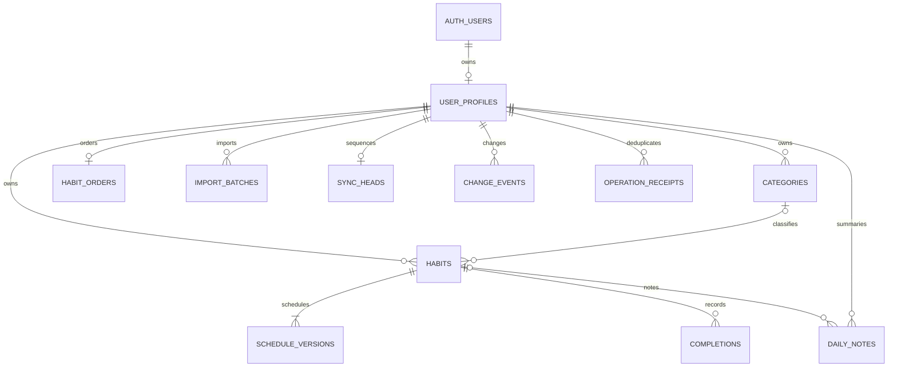

# 数据库 ER、字段与权限

> 本文保留第一阶段设计记录；第二阶段已实现的 RPC、执行顺序与验证结果见 [同步 API](sync-api.md) 和 [操作手册](sync-api-operations.md)。

本设计选择独立 `habit_api` 暴露业务表，`habit_private` 保存同步基础设施；不依赖 public 默认权限，也不暴露 auth schema。

所有业务表包含 `user_id`、`version`（正 bigint）、`created_at/updated_at`（服务端 timestamptz）、`deleted_at`（墓碑）。客户端时间只能辅助 UI，不能决定谁赢。version、sequence 经 JSON 传输用十进制字符串/BigInt，避免 JS 安全整数溢出。表主键以 user_id 开头，使相同旧 ID 在不同用户之间安全共存；所有业务外键都带 user_id，不能引用另一用户实体。

| 表                         | 关键字段与约束                                                                                      | 意义                                                                                                            |
| -------------------------- | --------------------------------------------------------------------------------------------------- | --------------------------------------------------------------------------------------------------------------- |
| user_profiles              | user_id→auth.users；calendar_timezone；version                                                      | 账号日历时区，使用 PostgreSQL pg_timezone_names 白名单在后续 RPC 校验；不存密码、token 或重复邮箱               |
| categories                 | (user_id,id)；name 1～30；preset                                                                    | 每个用户自己的预设/自定义分类，不共享可写全局表                                                                 |
| habits                     | (user_id,id)；name；color 0～4；category_id 可空；created_date；legacy_created_at_ms；archived_date | created_date 为历史民用日期，created_at 为数据库创建时间，两者不可混淆；归档截止保持 V1.1                       |
| schedule_versions          | (user_id,id)；unique(user_id,habit_id,effective_date)；kind；weekday_mask；weekly_target            | daily 无参数；weekdays 用 1～127 位掩码，ISO Monday bit0；weeklyQuota 为 1～7；初始日期从创建日起，后续周一生效 |
| completions                | (user_id,habit_id,date)；completed；version                                                         | 完成/撤销是同一逻辑记录的状态，撤销不物理删除，组合 ID 导出时重建                                               |
| daily_notes                | (user_id,id)；habit_id 可空；date；body ≤2000                                                       | PG15+ UNIQUE NULLS NOT DISTINCT 保证总体总结每天只有一条；清空内容保留墓碑；习惯备注不依赖打卡                  |
| habit_orders               | user_id；ordered_habit_ids text[]；version                                                          | 一个全局顺序版本；完整去重 ID 列表，删除和新建由事务修正；不在习惯上维护并发 order 整数                         |
| import_batches             | (user_id,id UUID)；source_sha256；source_schema；status；result_summary                             | 同账号相同源备份唯一；保存结果和映射、计数，不保存明文原始笔记或认证信息                                        |
| private.sync_heads         | user_id；last_sequence                                                                              | 每个用户一个严格提交顺序游标                                                                                    |
| private.change_events      | (user_id,sequence)；entity_type/key/version；payload；operation_id                                  | 不可变的变更后镜像/墓碑，用于可靠分页与恢复                                                                     |
| private.operation_receipts | (user_id,operation_id)；payload_sha256；result                                                      | 网络超时重试不会执行第二次；同 ID 不同 payload 拒绝                                                             |

ID 范围由 SQL CHECK 明确限制。备份预检超过限制时停止，不截断/静默改 ID。自然日期下限1900；未来日期、归档与创建之间范围、周一/初始计划、过去计划不可变等跨表动态约束必须由后续 RPC 服务器校验，不能只写前端。SQL基础迁移故意不开放业务写权限，避免这些尚未实现的规则被绕过。

## RLS 与授权

所有 11 张用户数据表 ENABLE + FORCE RLS；对 authenticated 的 SELECT USING `(select auth.uid()) = user_id`。8 张业务表另有 INSERT WITH CHECK、UPDATE USING/WITH CHECK 所有者策略，供后续 invoker RPC 使用；但本迁移**仅授予 SELECT**，不授予 INSERT/UPDATE/DELETE。没有任何 DELETE policy。3 张私有表没有客户端 schema usage 或 table privilege，仅有防御性 owner SELECT policy。

anon/PUBLIC 无 schema/table 权限；发布密钥仅确定 API 项目与匿名角色。登录后用户 JWT 才切换 authenticated；auth.uid()为空时不能匹配任何记录。即使用户在浏览器改 user_id，RLS 与联合外键也不允许越权。

默认权限按对象创建角色生效；schema级REVOKE不能抵消全局default grant（尤其PostgreSQL默认PUBLIC EXECUTE）。本迁移对现有创建表显式REVOKE后逐表GRANT，不依赖default privileges保护未来对象。后续每个新函数必须在创建事务中显式REVOKE PUBLIC/anon，再选择性GRANT，不能假定schema默认设置已经完成。

RLS 不限制 Supabase 的服务端 BYPASSRLS 角色或管理员，因此 service_role/secret key 永不进入前端。后续只能通过单独审核的 RPC 提供写权限：撤销 PUBLIC/anon 的 EXECUTE，grant EXECUTE to authenticated；函数设置固定空 search_path、全限定对象名、检查 auth.uid()、在锁下比较版本。SECURITY DEFINER 必须由受控迁移角色创建并逐字段白名单校验，不能暴露任意 SQL/表名/owner 参数。为避免 FORCED RLS/表所有者差异，必须在真实隔离 Supabase 项目验证函数执行角色与所有者策略，不能假定 definer 自动安全。

## 原子 RPC 后续合同（本迁移未实现）

- bootstrap_user：从 auth.uid()创建 profile、预设分类、空排序、sync_head；幂等，不使用 signup trigger 自动复制本地数据。
- apply_operations：operation_id、payload hash、expected_version、显式目标状态；先锁用户 sync_head，再读取/锁实体；校验 RLS所有权与业务规则；写实体、递增版本、分配事件序号、保存 receipt，同事务提交。一次请求有数量/字节上限，依赖操作必须同事务。
- import_preview/stage/commit：云端基线版本、冲突决策和 ID映射；先预览再事务提交，不提供全量覆盖接口。
- pull_changes(after,limit)：仅 auth.uid() 数据，返回不可变事件与高水位；不开放私有表。首次/full_snapshot 用单条SQL的一致MVCC快照同时返回实体及水位，或先锁sync_head FOR SHARE直到读完；默认READ COMMITTED的多条SELECT不足以保证一致。
- archive/delete_category/delete_habit/reorder/set_schedule：封装复合操作，不能拆成若干前端写表请求。

类别删除同事务解除所有习惯引用再写墓碑，不删习惯；习惯删除对记录、计划、备注写墓碑并调整排序；归档撤销当天打卡但保留备注。历史计划不允许直接 UPDATE/DELETE，当前时间以账号日历时区计算。物理 purge 独立管理操作，长期离线设备必须强制完整重同步，不能仅丢弃旧墓碑。

这里不使用全球 BIGSERIAL 作为已提交游标：事务先拿号后提交会乱序导致漏读。用户 sync_head 行锁在任何实体变更前获取，整个事务持有到提交，保证同用户事件提交顺序。private.change_events 的连续事件镜像也避免分页期间实体反复更新产生游标空洞。
